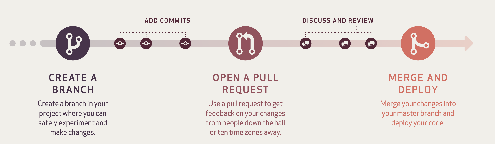

(authoring)=
# Authoring Markdown PrairieLean Questions

This is an overview of the steps you need to follow to author each question once you have completed the initial setup.
More detailed steps are available below, but here's a high-level overview:

1. Create a **new branch** for each new question in the `instructor_subject_bank`.

2. Create a **new directory** in the source folder under your topic or subtopic.

3. Crate a **markdown file** in the folder and add any **assets** such as images being used for your question.

4. Copy a question from the **templates** directory according to your question and start editing.

5. `Add`, `commit` and then `push` to the Github repository.

6. Create a pull request and add 1 or 2 reviewers to approve your work.

7. Add a `syntax check` label on Github and make sure it passes to go and take a look at the question on [PrairieLearn in the OPB 000 course](https://ca.prairielearn.com/pl/course/38/course_admin/questions). Fix any errors that you find.

8. Keep fixing the questions using feedback from reviewers and once ready, add the `ready_to_merge` label for a final review before the branch merges into `main`.

## General Guidelines on Workflow

1. We will be using a [Branch and Pull Request (PR)](https://guides.github.com/introduction/flow/) method to review contributions to the OPB.


Image credit for the above flow is from [GitHub Guides](https://guides.github.com/pdfs/githubflow-online.pdf).

2. Feel free to start a draft pull request while you're working on the question. When you're ready, you can click "ready for review". 

3. You should request reviews from at least one or two different students on the team.

*Avoid committing anything to this repository in the `output` directory; the files in there are automatically generated with scripts in the `scripts` directory, using the `source` files.*

## Detailed steps for authoring markdown questions

This is a detailed guide to author questions.

1. Using the Terminal on your computer, clone this repository locally (i.e. on your computer)

    > `git clone https://github.com/open-resources/instructor_physics_bank.git`

1. Change directory into the `instructor_physics_bank`

    > `cd instructor_physics_bank`

1. Make a new branch for your question with an appropriate name (replace `newbranchname` with your question number or description)

    > `git switch -c newbranchname` (the `-c` flag creates a new branch if it does not already exist)

1. Choose a problem that you want to write in markdown, take note of the source, and any attribution you may need to make. Use the [Topics, Subtopics, and Learning Outcomes](https://github.com/open-resources/learning_outcomes/blob/main/outputs_csv/LO_physics.csv) file to get the "Topic" and "Subtopic" - you will need to put the question in the correct directory.

1. Create a new directory with your question's name in the `source/YourTopic/QuestionTitle` or `source/YourTopic/YourSubtopic/QuestionTitle` directory to store your markdown file and any assets (usually images) associated with it.

    ```{tip}

    *Note that the directory structure follows the Topic/Subtopic scheme.*

    *If your question title is "Distance Travelled", the equivalent directory name is "distance_travelled" and the file containing the questions should be called "distance_travelled.md".*

    *So the final location of the `distance_travelled.md` should be:*

    > `source/003.Kinematics(1D)/Position/distance_travelled/distance_travelled.md`
    ```

1. Copy one of the question templates from the [templates](https://github.com/open-resources/instructor_physics_bank/tree/main/templates) directory into the directory you created in the two steps above. It seems the best way to do this is to copy and paste the file, and then rename it. For our example, that would be the `distance_travelled.md` file.

1. Edit the `distance_travelled.md` file to author your question. Feel free to "commit" to the repository as many times as you like. **Remember to use your local PrairieLearn Docker instance, and the `checkq.py` script to check the question on your machine**.

    ```{tip}
    Instructions for developing questions on PrairieLearn locally [can be found here](prairielearn_docker).
    ```

1. Here are the commands to first add it to the repository, then commit the file, then push it to GitHub:

    > `git add source/003.Kinematics(1D)/Position/`
    > 
    > `git commit -m "A message about a change you made`
    >
    > `git push`


    ```{tip}
    [Here's a video demo of the authoring process](https://vimeo.com/554494220).
    ```

1. Open the [instructor_physics_bank](https://github.com/open-resources/instructor_physics_bank) repo on GitHub.com and create a Draft Pull Request (PR). After you push your branch, you should see a green button called "Compare and Pull Request". 

1. When you're ready to have the problem reviewed by others, convert your Draft PR to an actual PR.

1. Add the `syntax check` label to trigger an automatic action to check the syntax of your question. Wait for the action to complete; fix any errors if it does not.

1. If the syntax check passes, go to [PrairieLearn](https://ca.prairielearn.org/pl/course_instance/2320/instructor/course_admin/questions) and to [Public version of the OPB](https://firas.moosvi.com/oer/physicsbank) to check if it looks as desired. Make any changes necessary to fix if not.

1. Verify the question looks as expected on the [Public version of the OPB](https://firas.moosvi.com/oer/physicsbank).

1. Request one or two reviewers on your problem, wait for their comments and then address them in more commits.

1. Add the `ready_to_merge` label to mark the question as ready to merge into the OPB after all the conversations have been resolved.

1. Switch back to the `main` branch locally:

    > `git switch main`

1. Pull any changes (if there are any):

    > `git pull`

Go back to step 3 to author a new question!

### Responding to reviews and making changes

When a reviewer responds to your pull request and suggests changes, make sure to perform those changes by switching back to this branch by using:

> `git switch YourBranchName` (you don't need the -c because the branch already exists)

Alternatively, you can use the [GitHub Command Line Interface (CLI)](https://docs.github.com/en/pull-requests/collaborating-with-pull-requests/reviewing-changes-in-pull-requests/checking-out-pull-requests-locally?tool=cli) to checkout the Pull Request directly:

> `gh pr checkout 124` (this will check out PR #124)

After making the changes, perform the `git add; git commit -m "fixed comments"; git push` commands once more to push the latest changes to the repository and respond to the reviewer.

More details about the [reviewing process can be found here](../guides/reviews.md).

## Useful links

- [Topics, Subtopics, and Learning Outcomes](https://github.com/open-resources/learning_outcomes/blob/main/Masterlist.csv)

- [Templates for different type of questions](https://github.com/open-resources/instructor_physics_bank/tree/main/templates)


### Guides

- [Guide to Reviewing questions](reviews)
- [Using Latex in questions](latex)
- [Rounding and Significant Figures in problems](rounding)
- [More tips for authoring questions](tips)

### Public Problem Banks

- [Public version of the OPB Physics](https://firas.moosvi.com/oer/physics_bank)
- [Public version of the OPB Engineering](https://firas.moosvi.com/oer/engineering_bank)
- [Public version of the OPB Statistics](https://firas.moosvi.com/oer/stats_bank)
- [Public version of the OPB Data Science](https://firas.moosvi.com/oer/datascience_bank)