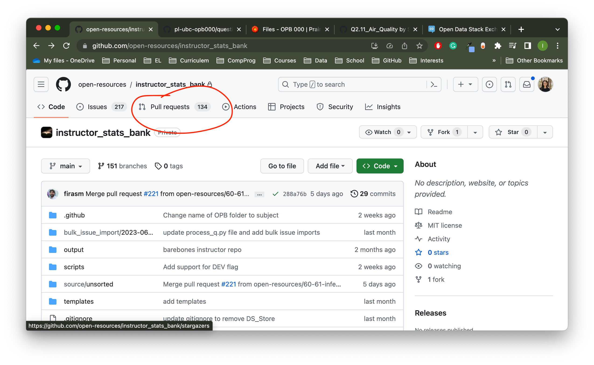
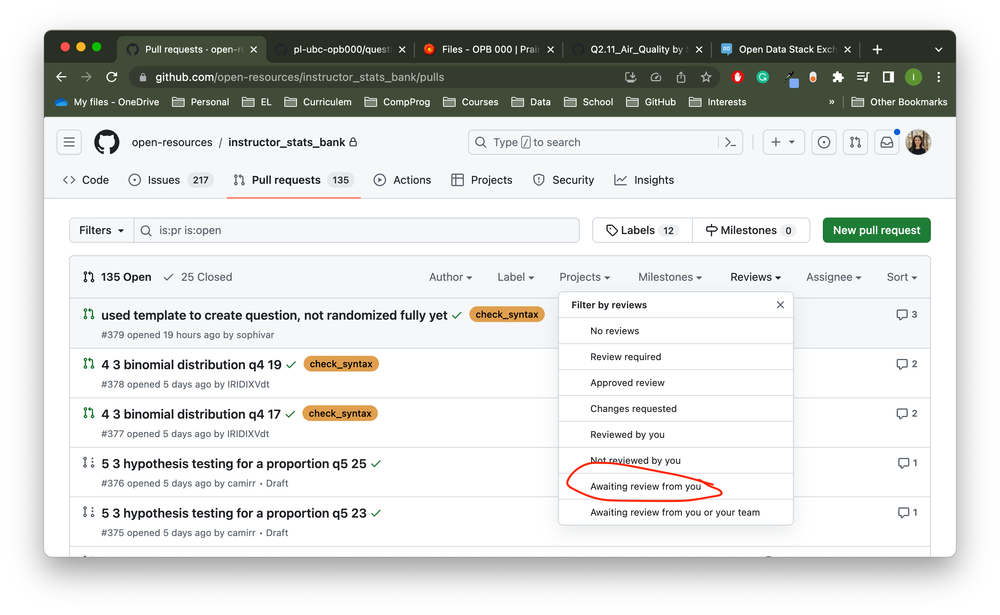
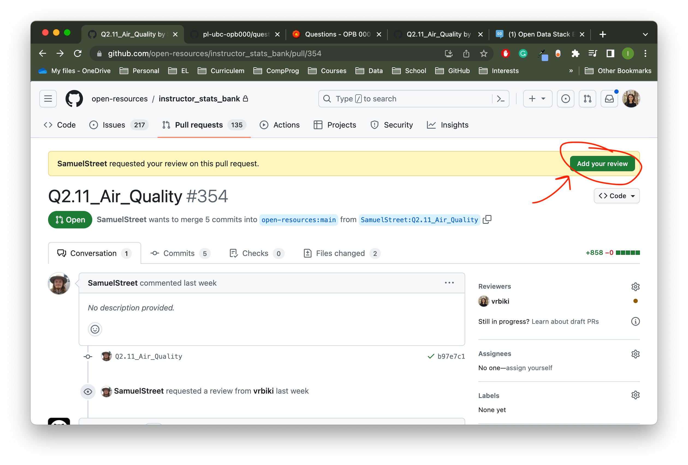
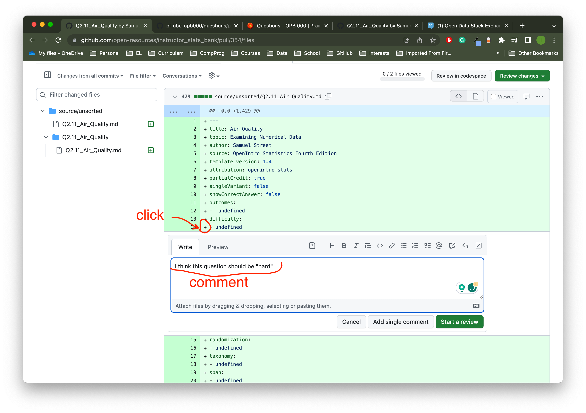
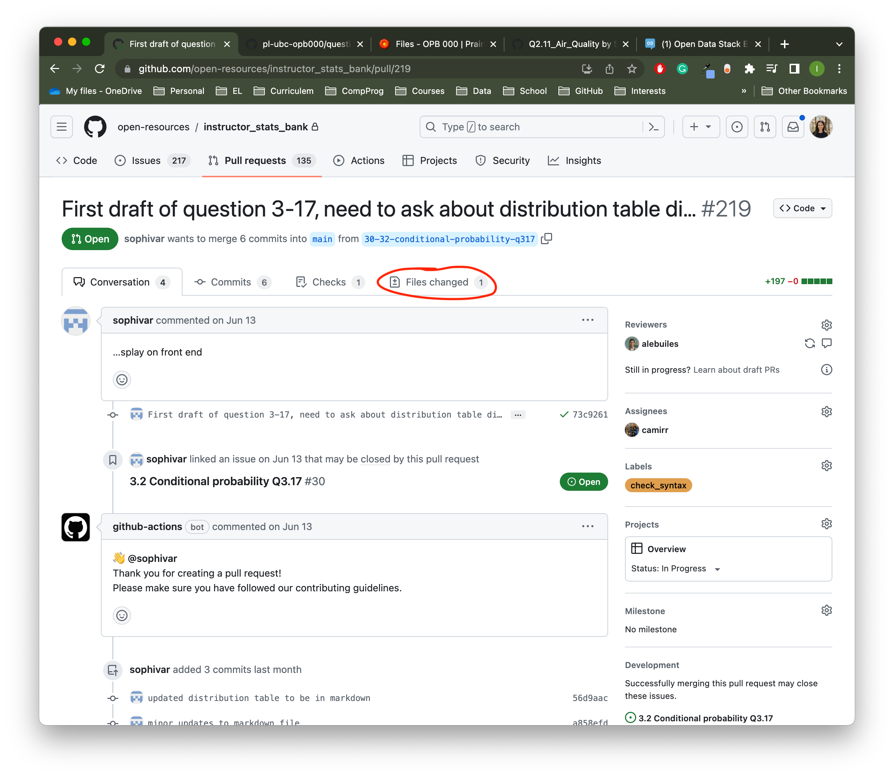
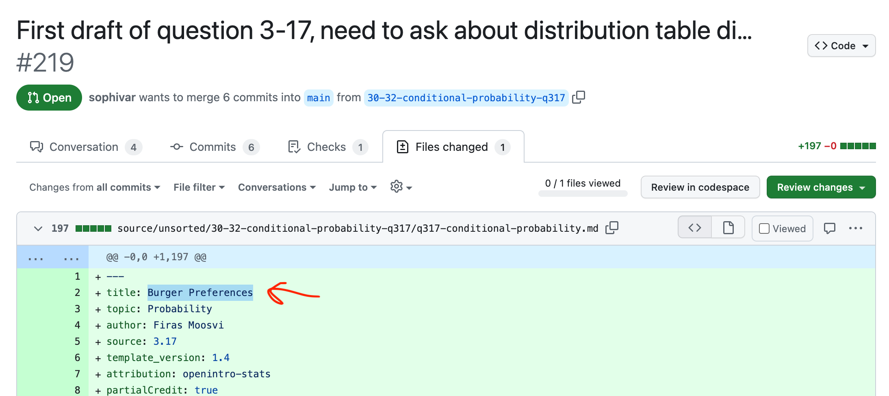

# Markdown and PrairieLearn

```{warning}
This section is currently under development and should not be consumed by people that aren't already using the PrairieLearn-Markdown authoring system in the "Open Problem Bank".
```

## Notes from Irene Vrbik

### Mark down system

Firas didn't like how there were three files for each question, so he came up with this markdown system that they would create a single file and through some GitHub action it would convert those markdown files into the three files.

## Reviewing Questions

The way we have set it up, we will not be editing the questions in PL, nor the corresponding GitHub repo.
Instead we will be reviewing questions in a separate GitHub repo: https://github.com/open-resources/instructor_stats_bank.
Here we will be reviewing the markdown files (as described in [Mark down system], these md files get converted to the 3 files we need for a PL question). 





To start your review, click the `Add your review` at the top of the page: 



Once you click that button, you will be shown all the files that are being changed in that pull request.
If you want to make a comment about a particular line(s)^[Multiline comments can be made but clicking and dragging] of code, click the "+" sign and leave a comment:


Even if you are not asked to do a review, you can still click on a question  and select the `Files Changed`:



At the top of the md file, you will see the title of the question



Assuming this question has already been moved to PL, you can search for this question name as described in [PrairieLearn Search].  

> Question: Ask Firas how questions are moved to PL (some questions I am reviewing are not showing up here yet).

