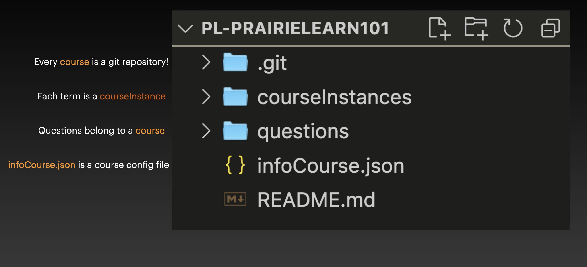

(pl_structure)=
# Structure of PrairieLearn

```{dropdown} Structure of PrairieLearn and Creating a Question
    :class-container: sd-shadow-lg
    :color: primary
    :open:

<div class="container youtube">
<iframe class="responsive-iframe" src="https://player.vimeo.com/video/902473831?h=8756a6194a&amp;badge=0&amp;autopause=0&amp;player_id=0&amp;app_id=58479" frameborder="0" allow="autoplay; fullscreen; picture-in-picture" allowfullscreen style="position:absolute;top:0;left:0;width:100%;height:100%;" title="PrairieLearn_tour"></iframe>
<script src="https://player.vimeo.com/api/player.js"></script>
</div>
```

Here is the basic structure of PrairieLearn:




