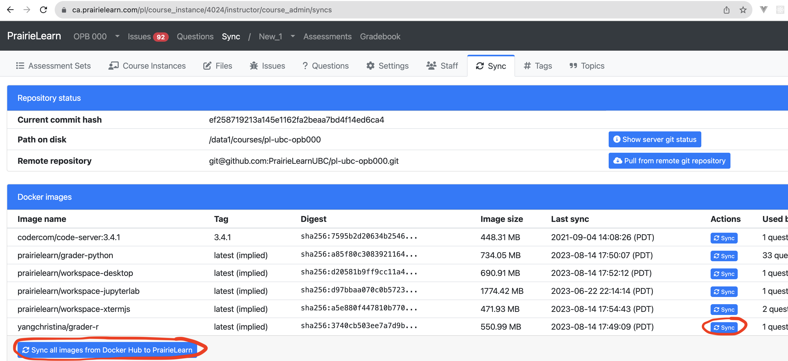

# Creating Docker Images

## Step 1: Create a Dockerhub Account
[Create a docker hub account](https://hub.docker.com/signup) if you don’t have one already.

## Step 2: Create your DockerFile

Example:
```Dockerfile
# Dockerfile
FROM prairielearn/grader-r

# Install R packages
RUN Rscript -e "install.packages('openintro')"
```

## Step 3: Push your Docker image to DockerHub
`cd` into the directory containing your DockerFile, then run the following commands:
```sh
docker login
docker build -t <image-name> .
docker tag grader-r:latest <dockerusername>/<image-name>:latest
docker push <dockerusername>/<image-name>:latest
```

## Step 4: Add your image to your PraireLearn question

Ex. If you are using this Docker image for the external autograder, add the image to your markdown YAML header.
```yaml
gradingMethod: External
externalGradingOptions:
    enabled: true
    image: <dockerusername>/grader-r  # made an image that has openstats installed, otherwise use prairielearn/grader-r
    entrypoint: /r_autograder/run.sh
    timeout: 60
```

## Step 5: Load Docker image into OPB 000



If your image shows up under "Docker Images", click the button under the "Actions" column
Otherwise, click "Sync all images from DockerHub to PrairieLearn"
If your image still doesn't show up under "Docker Images", try running your question first, then try syncing the image again.
