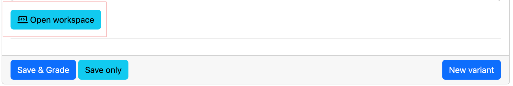

(prairielearn_docker)=
# PrairieLearn Course Development on Docker

This page describes the procedure to install and run your course locally within Docker.
The steps listed below **only need to be done once**, once you've got things setup correctly, you should refer to the [Question Development](authoring) page for subsequent questions.

## Step 1: Ensure Docker is installed on your machine

Before you start, make sure the Docker application is installed and running.

To confirm Docker is working, open a Terminal and run the following:

```bash
docker --version
```

You should get an output similar to:

```bash
Docker version y.y.y, build yyyyy
```

If this doesn't work, visit the Docker section in the setup guide for [macOS](page_install_ds_stack_macOS), or [Windows](page_install_ds_stack_windows).

<!-- #TODO: Add ubuntu page [Ubuntu](page_install_ds_stack_ubuntu) -->

## Step 2: Pull the PrairieLearn Docker container

Open a Terminal, and run the following to pull the PrairieLearn image:

```bash
docker pull prairielearn/prairielearn
```

On an M1/M2 Mac, you will probably get an error like,

> no matching manifest for linux/arm64/v8 in the manifest list entries

If so, set the platform to `linux/x86_64` (because there isn't an M1/M2 image yet) like this:

```bash
docker pull --platform linux/x86_64 prairielearn/prairielearn
```

It will take a few minutes to download (depending on your internet connection).

## Step 3: Run PrairieLearn using the example course

To Launch PrairieLearn locally, run the following command:

```bash
docker run -it --rm --pull=always -p 3000:3000 prairielearn/prairielearn
```

```{tip}
The PrairieLearn docker image is always being updated with new features and bug fixes. To ensure that you're always working with the latest PrairieLearn codebase, we add the `--pull=always` option to our Docker command.
```

Your Terminal will be occupied and while it's launching, the message in the Terminal will say "Starting PrairieLearn...".
Once it's launched, a message will print in the Terminal that says:

> info: Go to http://localhost:3000; 

visit that webpage in a new browser.
Your Terminal will still be occupied and you should keep it running.
To interrupt and stop the container, press `Ctrl + C` in the Terminal (you may have to do this several times).

In a browser, here's what you should see:


## Step 4: Load the Example Course

Every time you launch a PrairieLearn Docker container, you will need to load the list of courses.
By default, the PrairieLearn Docker image contains a directory named [`exampleCourse`](https://github.com/PrairieLearn/PrairieLearn/tree/master/exampleCourse).
First, click on "Load from disk" above and then click "PrairieLearn" in the top left corner to come back to this page.

Once you return to the PrairieLearn home page, here is what you should see:


## Step 5: Explore the Example Course

The example course contains many question and assessment types for you to explore.
You can experience the questions within Assessments (as students would see it), or browse questions from the Question Bank individually using tags and topics.

Here is what the Assessments will look like.


For more details about the example course and how to author your own questions, [see this section here](https://prairielearn.readthedocs.io/en/latest/getStarted/).

## Step 6: Stop the Docker Container

Once you're done exploring, stop the Docker Container (using `Ctrl+C` in the Terminal).
Another way to stop the Docker container is to open Docker Desktop and press the stop (⏹️) button.


```{tip}
This step is sometimes a bit finicky - your Terminal may stop responding when trying to stop the Container using `Ctrl+C`.
If that happens, don't close the Terminal, and use the Docker Desktop to stop the container.
```

## Step 7: Fork the IND 100 sample PrairieLearn course

If you haven't already done this, follow the [steps outlined here](opb_course_repo).

<!-- 
## Step 6: Request your own course on PrairieLearn

Once you're ready to develop questions for your own course, you should first request a course through the appropriate PrairieLearn instance:


Once you have a PrairieLearn course, you should clone it locally, and then add it to your local Docker container (see next step).
 -->

## Step 8: Add your own course to the local PrairieLearn instance

To use your own course, bind the Docker `/course` directory with your own course repo directory using the `-v` flag.
In the command below, replace `local_path` with the path to where your course repo is cloned locally:

```bash
docker run -it --rm --pull=always -p 3000:3000 -v local_path:/course prairielearn/prairielearn
```

````{tip}
For staff working on the Open Problem Bank, your `local_path` should be the **absolute path** wherever you cloned the IND 100 (`pl-opb-ind100`) and the `instructor_subject_bank` repositories.

For example, the exact command for me is:

```bash
docker run -it --rm --pull=always -p 3000:3000 -v ~/Sync/EL/OPB/course_dev/pl-opb-ind100:/course prairielearn/prairielearn 
```
````

```{tip}
If you are using Docker for Windows then you will need to first give Docker permission to access the `C:` drive (or whichever drive your course directory is cloned in).
This can be done by right-clicking on the Docker "whale" icon in the taskbar, choosing "Settings", and granting shared access to the `C:` drive.
```

To use multiple courses, add additional `-v` flags (e.g., -v /path/to/course:/course -v /path/to/course2:course2).
There are nine available mount points in the Docker: `/course`, `/course2`, `/course3`, `...`, `/course9`.

If you're in the root of your course directory already, you can substitute `%cd%` (on Windows) or `$PWD` (Linux and MacOS) for `/path/to/course`.

<!-- 
If you plan on running externally graded questions in local development, please see [this section](https://prairielearn.readthedocs.io/en/latest/externalGrading/#running-locally-on-docker) for a slightly different docker launch command.

**NOTE**: On MacOS with "Apple Silicon" (ARM64) hardware, the use of R is not currently supported.
 -->

<!-- 
## Step 9: Run the script to move a question from the `instructor_subject_bank` to IND 100

Since we are writing questions for the OPB using MyST Markdown (more details about this later), there is an extra processing step to convert the `.md` file to the PrairieLearn format (`.html`, `.json`, and `.py` files).
This processing step is somewhat automated using GitHub Actions, but it's often helpful to do the processing locally since it takes much less time and is more efficient when troubleshooting.
Here are the steps to run the processing step on an `.md` question to create `.html`, `.json`, and `.py` files, and then move them over to the IND 100 and see how the question looks.

- Open a Terminal on your local machine, and change directory to where the `instructor_subject_bank` is cloned.
- `cd` into the `scripts` directory.
- Run the script on a particular question: 

```bash
python checkq.py ../source/001.Math/Algebra/Smudge/Smudge.md --output_root=../../pl-opb-ind100/questions/FM
```
-->

## Step 9: Author your questions

Once you've tweaked your question within your course repository, you can view the question locally using these steps:

- Open the local instance of PrairieLearn in your browser (http://localhost:3000).
- Click "Load from Disk".
- Verify the question works as expected on PrairieLearn in the browser.

```{important}
When developing locally on PrairieLearn, you **must** click "Load from Disk" every time you make a change in your `questions` directory!


```

That's it!
You're ready to develop questions for the `OPB`!

## Setting up local autograder container

For development of questions that require an autograder, you will need to set up a local autograder container as well. 

```{important}
Follow this section for any questions that require usage of external autograders, including PrairieLearn workspace questions. 

Some questions, such as the example below, contain built-in notebooks. To work with these questions locally, follow the docker initialization command in this section instead of the command described in step 8.
```


### Important! (Windows Only)

If you are using Windows, the following commands will need to be executed in Windows Subsystem for Linux (WSL). You can do this two ways:
1. Open a command prompt and type `wsl` to open a WSL terminal
1. Look for the Windows Subsystem for Linux application in the Start Menu


### Step 1: Create a local directory for the autograder

To run PrairieLearn locally with external grader and workspace support, create an empty directory to use to share job data between containers. This directory can live anywhere, but needs to be created first and referenced in the docker launch command. This directory only needs to be created once.

```bash
mkdir "$HOME/pl_ag_jobs"
```

### Step 2: Run the PrairieLearn Autograder container

Now, run PrairieLearn as usual, but with additional options. For example, if your course directory is in $HOME/pl-tam212 and the jobs directory created above is in $HOME/pl_ag_jobs, and you are using Linux or Mac OS X, the new command is as follows:

```bash
docker run -it --rm --pull=always -p 3000:3000 \
    -v "$HOME/pl-opb-ind100:/course" `# Replace the path with your course directory` \
    -v "$HOME/pl_ag_jobs:/jobs" `# Map jobs directory into /jobs` \
    -e HOST_JOBS_DIR="$HOME/pl_ag_jobs" \
    -v /var/run/docker.sock:/var/run/docker.sock `# Mount docker into itself so container can spawn others` \
    prairielearn/prairielearn
```

If you are on Windows, you can use the following command on the WSL 2 shell:

```bash
docker run -it --rm --pull=always -p 3000:3000 \
    -v "$HOME/pl-opb-ind100:/course" `# Replace the path with your course directory` \
    -v "$HOME/pl_ag_jobs:/jobs" `# Map jobs directory into /jobs` \
    -e HOST_JOBS_DIR="$HOME/pl_ag_jobs" \
    -v /var/run/docker.sock:/var/run/docker.sock `# Mount docker into itself so container can spawn others` \
    --add-host=host.docker.internal:172.17.0.1 \
    prairielearn/prairielearn
```

*NOTE*: When replacing the path with your course directory on Windows, make sure to use a POSIX-style path (e.g. `/mnt/c/Users/username/pl-opb-ind100`) and __not__ the Windows path (e.g. `C:\Users\username\pl-opb-ind100`).

### Note: Grader images

When attempting a question with the autograder configured for the first time, the grader image will be automatically pulled by PrairieLearn. This may take a few minutes, but will only need to be done once. The grader image will be cached locally for future use. If PrairieLearn is unable to pull the grader image, it may be necessary to manually pull the image using the following command:

```bash
docker pull prairielearn/grader-python
```

*Note*: The above command is for the Python grader image. If you are using a different grader image, you will need to replace `prairielearn/grader-python` with the appropriate image name.