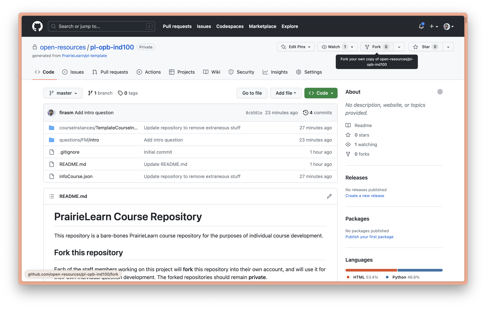
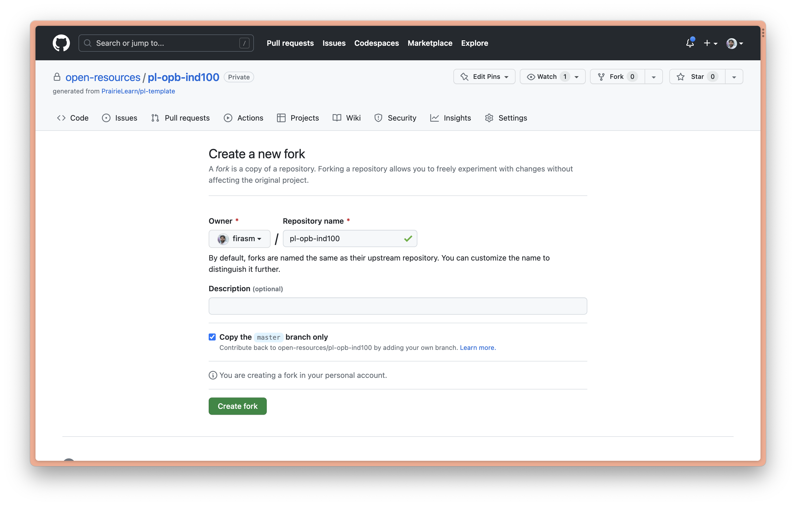
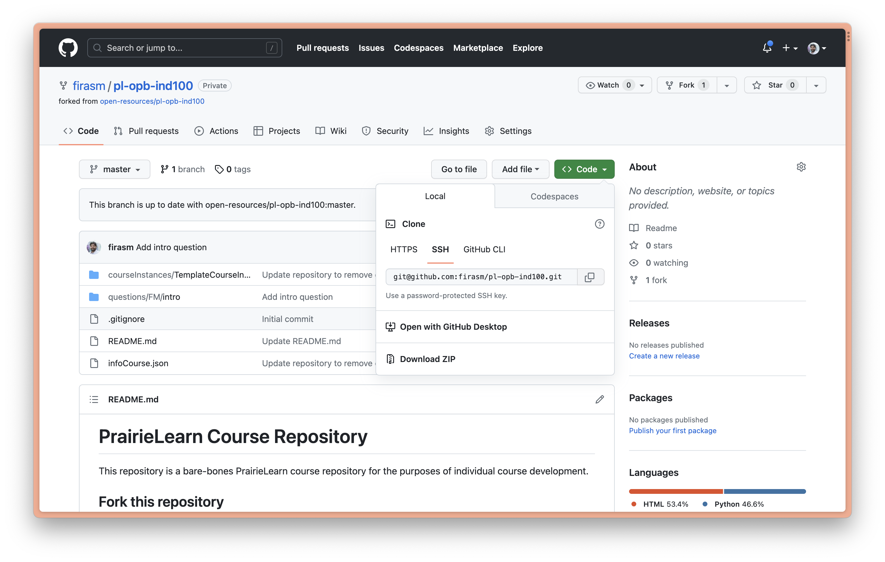

# Forking a PrairieLearn course for local development

It takes a lot of trial and error to get the hang of developing questions on PrairieLearn, particularly if you are algorithmically randomizing the questions.
From experience, the best way to develop questions is to have access to a demo course of your own so you can see exactly how the questions are rendered, and what tweaks need to be made to improve how the questions are displayed.

To get your own PrairieLearn course for local development, follow these steps:

## Step 1: Visit the [IND 100](https://github.com/open-resources/pl-opb-ind100) course repository.



## Step 2: Fork the IND 100 repo into your **personal GitHub account**.



## Step 3: Clone your fork of the IND 100 repository locally

```{warning}
For best results, you should clone your `IND 100` course repository in the same directory your cloned `instructor_subject_bank`.
```

Open a Terminal, navigate to the directory you want to clone the IND 100 course and then run:

```
git clone git@github.com:firasm/pl-opb-ind100.git
```



Once you've got the repository cloned locally, you can [use Docker to continue course development](prairielearn_docker).

