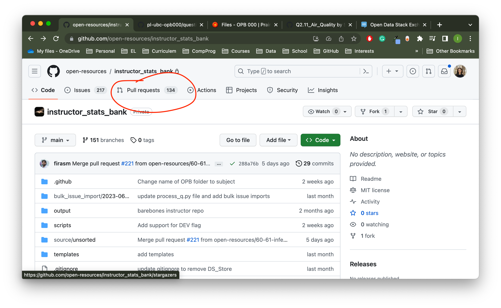
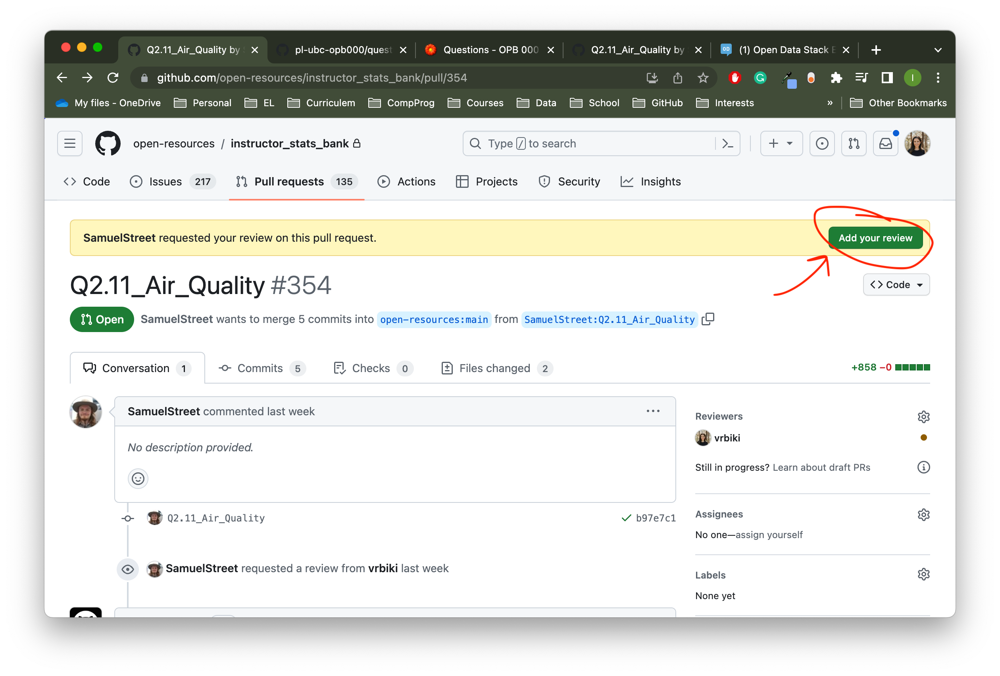
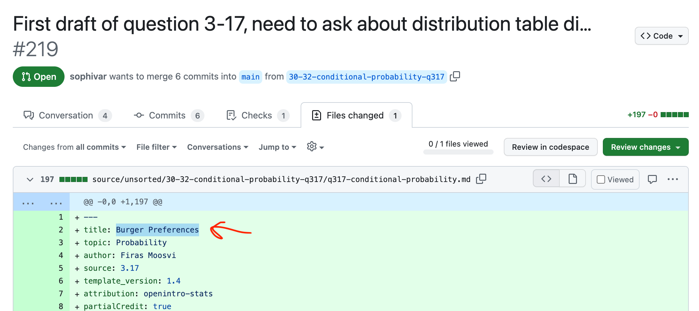

# Instructor Guide

The following guide was written by Dr. Irene Vrbik as she was given a tour of the PrairieLearn interface.

## PrairieLearn

Questions from the Open Problem Bank (OPB) will be hosted on PrairieLearn (PL): https://ca.prairielearn.com/pl (requires sign in).
There is a course _OPB 000_ which contains all the questions from all the banks that have been created - so far, Physics, Data Science, and Statistics.

### Courses

Every course in Prairie Learn is associated with a GitHub repository, usually `pl-ubc-course_code`.
For example, the fake course above is associated with: https://github.com/PrairieLearnUBC/pl-ubc-opb000.
Every "instance" of a course is stored in a different directory of the GitHub repo:

### Instances

An "instance" usually correspond to a particular offering of a course.
When you click on instance on PL, you will give you all the homework that you set for that particular offering of the course (you can copy these from previous years).

### Questions

Every _assessment_ has to have a corresponding _category_:

If you click an assessment, it will default to the questions tab, which lists all of the questions in that assessment:

### Files

In the `Files` tab, you will see a JSON file which sets what questions are in each assessment.
Every question you create will have weights that will add up to 1.
You can scale how much a question is worth on a assessment with the `points` option:

For example, the `Motion_of_watermelon` question will be worth 2.5 and  the `merry_go_round` question will only be worth 1.5.
If the watermelon question was five parts with equal weight for each part, each part would be award 0.5 points each.  
If the merry go round question had two parts with the first part having double the weight of the second part, they would be 1 pt, and 0.5 pts, respectively. 

> Question: where are the weights set in a question?

`numberChoose` indicates how many questions should be selected from the list below.
Note that you can not yet point to a directory and have to list every question you want to be considered.

### Question Stats

On the `Question stats` tab in PL, you can see view some question analytics:

This could be useful in configuring which questions should be grouped together (e.g. makes sense for _swimming mass_ and _speed skating_ to be grouped together since they have similar stats) and if the difficulty level is appropriate.

### Access Rules

Block 1 indicates when the student will be able to see the assessment (`active: false` indicates that they won't be able to click it).
Block 2 indicates when the student will be able to see AND access the assessment.
The `credit` level indicates how much credit they will receive if they complete the assessment during the associated window.
You can also do more complicated `credit` levels to penalize late submissions.

In addition you could provide some incentive for completing the assessment early.
This can be a great way to catch mistakes before the bulk of the students start their first attempt

> Question: can you create penalties for additional attempts?

## GitHub repo

On the [github repo](https://github.com/PrairieLearnUBC/pl-ubc-opb000) you will see a folder entitled `questions` we will store all of the questions that we will be eventually putting in to our prairie learn Stats course (not yet created).

This is the backhand structure (which is optional^[its not clear to my how this is optional]). Inside each of the disciple directory there will be sub directories of topics.  Inside each topic, is a subtopic.  For example the `physics` folder contains the topic sub directories of `001.Math`, ... , `003.Vectors`, ..., `008.Energy`, ... e.g., `008.Energy` topic has subtopics of Conservation of Energy, Energy Diagrams, Kinetic Energy, Pendulum Kinetics, etc.

## Questions 

### Github file view

Each questions will be stored in one of this subtopic sub-sub-directories.
There is a minimum of three files associated with every question. 

- `info.json` contains the meta data (e.g., title, tags, topic)
- `question.html` what the student sees
- `server.py` is the randomization code that will give different variants

### Prairie Learn Search

To see the corresponding question in Prairie learn, navigate to the questions tab:

Unfortunately, the folder system isn't visible to the use in the Finder-like way, and it shows all the questions in the `questions` directory as a long list.
So to find the particular question used as example in [Github file view] you would look up the question name _Kinetic Energy Definition_ in the Prairie Learn search bar:

When you click on the question (make sure you are in the Preview mode) you will be able to see how the student will view the question (which is rendered from the `question.html` file):

You can view the source files by pressing the Files tab

The path to the question in PL (highlighted in green above) is the same as the path in the corresponding github subdirectory in the `questions` folder: https://github.com/PrairieLearnUBC/pl-ubc-opb000/tree/master/questions/physics/008.Energy/Kinetic%20Energy/Kinetic%20Energy%20Definition.
These three files are created from the ... source file; the process is explained in [Mark down system].

### server.py file

The `server.py` file is where the random numbers and options are generated. Custom grading can also go here.

### question.html

This file generates the question that the student will view on PL.
Within the `question.html` file, you can pull anything from the `server.py` file (_via_ curly brackets `{{ }}`)

### Mark down system

Firas didn't like how there were three files for each question, so he came up with this markdown system that they would create a single file and through some GitHub action it would convert those markdown files into the three files.

## Reviewing Questions

The way we have set it up, we will not be editing the questions in PL, nor the corresponding GitHub repo.
Instead we will be reviewing questions in a separate GitHub repo: https://github.com/open-resources/instructor_stats_bank.
Here we will be reviewing the markdown files (as described in [Mark down system], these md files get converted to the 3 files we need for a PL question). 

To start your review, click the `Add your review` at the top of the page: 

Once you click that button, you will be shown all the files that are being changed in that pull request.
If you want to make a comment about a particular line(s)^[Multiline comments can be made but clicking and dragging] of code, click the "+" sign and leave a comment:

Even if you are not asked to do a review, you can still click on a question  and select the `Files Changed`:

At the top of the md file, you will see the title of the question

Assuming this question has already been moved to PL, you can search for this question name as described in [PrairieLearn Search].  

> Question: Ask Firas how questions are moved to PL (some questions I am reviewing are not showing up here yet).

